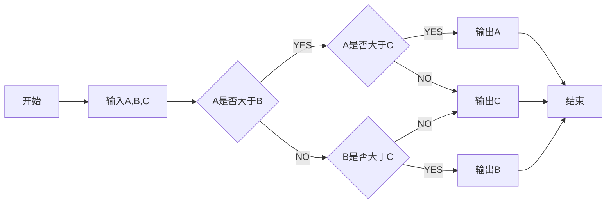

# 一、宁波POC测试准备工作
## 1. 蓝鲸社区版安装
1. **git服务器**

  mac环境下搭建git服务器，Windows下也可以，百度或谷歌搜索gitbkit。
  我使用了 [gitbkit](https://blog.csdn.net/pony_maggie/article/details/50880142) ，gitbkit需要Java1.8之前的版本支持，较新的版本会有问题。
  我的mac自带的java已经升级到11，另安装了一套1.7的版本，我将使用1.7版本。

  *查看java版本：*

  ```  
  $ $JDK_HOME/bin/java -version
  java version "1.7.0_80"
  Java(TM) SE Runtime Environment (build 1.7.0_80-b15)
  Java HotSpot(TM) 64-Bit Server VM (build 24.80-b11, mixed mode)
  $ java -version
  java version "11" 2018-09-25
  Java(TM) SE Runtime Environment 18.9 (build 11+28)
  Java HotSpot(TM) 64-Bit Server VM 18.9 (build 11+28, mixed mode)
  ```
  *当前工作目录：*

  ```
  $ pwd
  /Users/zhanglibing/gitserver/gitblit-1.8.0
  ```
  *运行gitblit：*

  ```
  $ $JDK_HOME/bin/java -jar gitblit.jar --baseFolder data
  ```

2. **本地yum源服务器搭建**
  作为yum源的web服务器，我使用了mac自带的httpd服务。

  Centos7.iso和epel.zip是上海同事传给我的，在Linux下解压epel.zip后里面只有Packages目录，作为yum源缺失了repodata和drpms目录，我找到了 [腾讯epel源的服务器](<https://mirrors.cloud.tencent.com/epel/>), 在Index of /epel/7/x86_64/下找到了相应的目录，把两个目录里面的文件一个个下载下来，并分别放置到新建的与Packages平行的repodata和drpms目录下，用mkisofs重新制作了epel.iso。
  *Linux下制作光盘镜像：*

  ```
  mkisofs -r -o epel.iso epel/
  ```

  mac下把Centos7.iso和epel.iso双击打开即可挂载为光盘，用ln连接到httpd的Document目录下。

  *查看httpd的配置：*

  ```
  $ cat /etc/apache2/httpd.conf|grep DocumentRoot
  # DocumentRoot: The directory out of which you will serve your
  DocumentRoot "/Library/WebServer/Documents"
  # access content that does not live under the DocumentRoot.
  ```
  *查看httpd的www根目录：*

  ```
  $ cd /Library/WebServer/Documents
  $ ls -la
  total 72
  drwxr-xr-x  8 root  wheel    256  3 29 22:22 .
  drwxr-xr-x  5 root  wheel    160  8 18  2018 ..
  lrwxr-xr-x  1 root  wheel     14  3 29 20:27 Centos7 -> /Volumes/CDROM
  lrwxr-xr-x  1 root  wheel     16  3 29 22:22 Centos7-epel -> /Volumes/CDROM 1
  -rw-r--r--  1 root  wheel   3726  8 18  2018 PoweredByMacOSX.gif
  -rw-r--r--  1 root  wheel  31958  8 18  2018 PoweredByMacOSXLarge.gif
  -rw-r--r--  1 root  wheel     45  6 12  2007 index.html.en
  -rw-r--r--  1 root  wheel     45  6 12  2007 index.html.en~orig
  ```
  *启动httpd：*
  `sudo apachectl start`

3. **yum源配置**  

  ```
  $ ssh root@192.168.1.197
  root@192.168.1.197's password: 
  Last login: Sat Mar 30 00:59:06 2019 from 192.168.1.88
  [root@localhost ~]# cd /etc/yum.
  yum.conf     yum.repos.d/ 
  [root@localhost ~]# cd /etc/yum.repos.d/
  [root@localhost yum.repos.d]# ls
  backup  Centos7-epel.repo  Centos7.repo  redhat.repo
  [root@localhost yum.repos.d]# cat Centos7.repo
  [Centos7]
  name=Centos7 Repository
  baseurl=http://192.168.1.88/Centos7
  gpgcheck=0
  enabled=1
  [root@localhost yum.repos.d]# cat Centos7-epel.repo
  [Centos7-epel]
  name=Centos7-epel Repository
  baseurl=http://192.168.1.88/Centos7-epel
  gpgcheck=0
  enabled=1
  [root@localhost yum.repos.d]# 
  ```

4. 蓝鲸安装环境准备
  - 准备三台服务器：192.168.1.197,192.168.1.198,192.168.1.199
  - 上传Centos7.repo和Centos7-epel.repo到三台服务器的/etc/yum.repos.d目录下
  - 三台服务器均执行yum源生效指令并安装常用工具：
  ```
  [root@localhost ~]# yum clean all
  [root@localhost ~]# yum makecache
  [root@localhost ~]# yum install vim wget net-tools rsync
  ```
  - 三台服务器均执行关闭SELinux和防火墙服务：
  ```
  [root@localhost ~]# sestatus
  sestatus
  SELinux status:                 enabled
  SELinuxfs mount:                /sys/fs/selinux
  SELinux root directory:         /etc/selinux
  Loaded policy name:             targeted
  Current mode:                   enforcing
  Mode from config file:          enforcing
  Policy MLS status:              enabled
  Policy deny_unknown status:     allowed
  Max kernel policy version:      28
  [root@localhost ~]# setenforce 0
  `#下面这条7.4无效`
  [root@localhost ~]# sed -i 's/^SELINUX=enforcing/SELINUX=disabled/g' /etc/sysconfig/selinux
  `#需用下面这条指令`
  [root@localhost ~]# sed -i 's/^SELINUX=enforcing/SELINUX=disabled/g' /etc/selinux/config
  [root@localhost ~]# systemctl stop firewalld.service
  [root@localhost ~]# systemctl disable firewalld.service
  [root@localhost ~]# systemctl status firewalld.service
  [root@localhost ~]# systemctl list-unit-files|grep firewalld
  [root@localhost ~]# reboot
  ```
  - 三台服务器均执行调整最大文件打开数:
  ```
  [root@localhost ~]# ulimit -n
  [root@localhost ~]# cat <<EOF > /etc/security/limits.d/99-nofile.conf
   root soft nofile 102400
   root hard nofile 102400
   EOF
  [root@localhost ~]# reboot
  ```
  - 三台服务器均执行 ```yum install ntp ntpdate``` ,中控服务器编辑/etc/ntp.conf：
  ```
  driftfile /var/lib/ntp/drift
  restrict default nomodify notrap nopeer noquery
  restrict 127.0.0.1
  restrict ::1
  # 外部时间服务器不可用时，以本地时间作为时间服务
  server  127.127.1.0     # local clock
  fudge   127.127.1.0 stratum 10
  includefile /etc/ntp/crypto/pw
  keys /etc/ntp/keys
  disable monitor
  ```
  其他服务器编辑/etc/ntp.conf：
  ```
  # 配置时间服务器为本地的时间服务器
  server 192.168.1.197
  restrict 192.168.1.197 nomodify notrap noquery
  server  127.127.1.0     # local clock
  fudge   127.127.1.0 stratum 10
  includefile /etc/ntp/crypto/pw
  ```
  三台服务器均执行

  ```
  [root@localhost ~]# systemctl start ntpd.service
  [root@localhost ~]# systemctl enable ntpd.service
  [root@localhost ~]# systemctl disable chronyd.service ##不禁止chronyd会导致ntpd开启启动失败
  [root@localhost ~]# reboot
  [root@localhost ~]# ntpq -p
  [root@localhost ~]# systemctl status ntpd.service
  ```

5. 安装蓝鲸平台
  - 上传bkce_src-4.1.16.tgz到主控服务器，并解压：
  ```
  $ cd ~/POC/ningbo
  $ scp bkce_src-4.1.16.tgz root@192.168.1.197:/data
  $ ssh root@192.168.1.197
  [root@localhost ~]# cd /data
  [root@localhost data]# tar xf bkce_src-4.1.16.tgz  -C /data
  ```
  - 修改install.config：
  ```
  [root@localhost data]# cd install
  [root@localhost install]# cp install.config.3IP.sample install.config
  [root@localhost install]# vim install.config
  ```
  - install.config配置内容：
  ```
  192.168.1.199 nginx,appt,rabbitmq,kafka,zk,es,bkdata,consul,fta
  192.168.1.198 mongodb,appo,kafka,zk,es,mysql,beanstalk,consul
  192.168.1.197 paas,cmdb,job,gse,license,kafka,zk,es,redis,consul,influxd
  ```
  - 修改globals.env：修改BK_DOMAIN,MYSQL_PASS,PAAS_ADMIN_PASS
  - 执行```ifconfig```获取中控机mac地址，进入[证书](https://bk.tencent.com/download_ssl/)页面下载证书，上传到中控级/data目录下，并执行：
  ```
  [root@localhost data]# tar xf ssl_certificates.tar -C /data/src/cert/
  ```
  - 关闭NetworkManager(三台机器均执行)：
  ```
  [root@localhost install]# systemctl stop NetworkManager
  [root@localhost install]# systemctl disable NetworkManager
  [root@localhost install]# reboot
  [root@localhost install]# systemctl status NetworkManager
  ```
  - 开始安装蓝鲸平台，每执行完一步，用浏览器验证相应功能模块
  ```
  [root@localhost install]# ./bk_install paas
  [root@localhost install]# ./bk_install cmdb
  [root@localhost install]# ./bk_install job
  [root@localhost install]# ./bk_install app_mgr
  [root@localhost install]# ./bk_install bkdata
  [root@localhost install]# ./bk_install fta
  [root@localhost install]# ./bkcec install gse_agent
  [root@localhost install]# ./bkcec install saas-o
  ```
  - **<u>*安装cmdb时报错，31001端口被占，重装后可以：</u>***
  ```
  [root@localhost install]# ./bkcec stop cmdb
  [root@localhost install]# ./bkcec install cmdb 1
  [root@localhost install]# ./bkcec start cmdb
  [root@localhost install]# ./bkcec initdata cmdb
  ```


问题1：supervisor 包安装总是报错，屏蔽掉就ok了。

pip download -d ~/POC/ningbo/pypi -r requirements.txt 

问题2：安装windows agent，需要蓝鲸平台能够访问windows的135，139，445三个端口。


  [root@localhost yum.repos.d] 
  1.2 三台服务器：编辑 /etc/yum.conf 文件中, 将文件中的 keepcache=0 改为 keepcache=1, 开启缓存功能  

```
[root@localhost ~]# vi /etc/yum.conf
```

mkisofs -r -o epel.iso epel/

sudo mount -o loop -t iso9660 /Users/zhanglibing/Centos7.iso /Library/WebServer/Documents/CentOS7/

[root@localhost yum.repos.d]# cat Centos7.repo 
[Centos7]
name=Centos7 Repository
baseurl=http://192.168.1.88/Centos7
gpgcheck=0
enabled=1


1.2 上传蓝鲸安装包到服务器192.168.1.197上
 -   

## 2. DEMO开发事项事项
1. 创建数据库  
```
[root@rbtnode1~]# mysql -uroot -pYtX#_]O[6n -h192.168.1.51
MySQL [(none)]> Create database ningbo default charset utf8;
```
2. 开通数据库访问权限  
```
use mysql;
GRANT ALL PRIVILEGES ON *.* TO 'root'@'192.168.1.88' IDENTIFIED BY 'YtX#_]O[6n' WITH GRANT OPTION;
--要不要执行下一句不确定
insert into user(Host      , User , Password , Select_priv , Insert_priv , Update_priv , Delete_priv , Create_priv , Drop_priv , Reload_priv , Shutdown_priv , Process_priv , File_priv , Grant_priv , References_priv , Index_priv , Alter_priv , Show_db_priv , Super_priv , Create_tmp_table_priv , Lock_tables_priv , Execute_priv , Repl_slave_priv , Repl_client_priv , Create_view_priv , Show_view_priv , Create_routine_priv , Alter_routine_priv , Create_user_priv , Event_priv , Trigger_priv , Create_tablespace_priv , ssl_type , ssl_cipher , x509_issuer , x509_subject , max_questions , max_updates , max_connections , max_user_connections , plugin , authentication_string) select '192.168.1.88',User , Password , Select_priv , Insert_priv , Update_priv , Delete_priv , Create_priv , Drop_priv , Reload_priv , Shutdown_priv , Process_priv , File_priv , Grant_priv , References_priv , Index_priv , Alter_priv , Show_db_priv , Super_priv , Create_tmp_table_priv , Lock_tables_priv , Execute_priv , Repl_slave_priv , Repl_client_priv , Create_view_priv , Show_view_priv , Create_routine_priv , Alter_routine_priv , Create_user_priv , Event_priv , Trigger_priv , Create_tablespace_priv , ssl_type , ssl_cipher , x509_issuer , x509_subject , max_questions , max_updates , max_connections , max_user_connections , plugin , authentication_string from user where Host='127.0.0.1';
```
---

# 一、标题
# 这是一级标题
## 这是二级标题
### 这是三级标题
#### 这是四级标题
##### 这是五级标题
###### 这是六级标题

# 二、字体
**这是加粗的文字**

*这是倾斜的文字*

***这是斜体加粗的文字***

~~这是加删除线的文字~~


# 三、引用
>这是引用的内容
>>这是引用的内容
>>
>>>>>>>>>>这是引用的内容

# 四、分割线
---
----
***
*****

# 五、图片


# 六、超链接
[简书](http://jianshu.com)
[百度](http://baidu.com)

# 七、列表
- 列表内容
+ 列表内容
* 列表内容
注意：- + * 跟内容之间都要有一个空格
1. 列表内容
2. 列表内容
3. 列表内容
注意：序号跟内容之间要有空格

# 八、表格
姓名|技能|排行
--|:--:|--:
刘备|哭|大哥
关羽|打|二哥
张飞|骂|三弟

# 九、代码
   `代码内容`
```
  代码...
  代码...
  代码...
```

# 十、流程图
```flow
graph LR
st=>start: 开始 
e=>end: 登录 
io1=>inputoutput: 输入用户名密码 
sub1=>subroutine: 数据库查询子类 
cond=>condition: 是否有此用户 
cond2=>condition: 密码是否正确 
op=>operation: 读入用户信息

st->io1->sub1->cond 
cond(yes,right)->cond2 
cond(no)->io1(right) 
cond2(yes,right)->op->e 
cond2(no)->io1 
```


  ```
    https://unpkg.com/mermaid@7.1.0/dist/
    ```